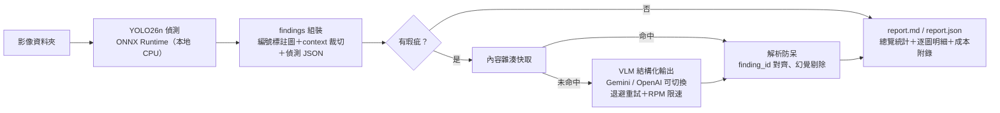

# visual-inspection-reporter

> PCB 產線巡檢報告產生器：本地 YOLO26 ONNX 偵測 + 商用 VLM API → 繁體中文巡檢報告

輸入一批 PCB 影像，輸出一份繁體中文巡檢報告（`report.md` + `report.json`）：自訓的 YOLO26n 小模型在本地做瑕疵偵測（ONNX Runtime、CPU 即可），偵測結果組裝成「編號標註整圖 + 局部放大圖 + 偵測 JSON」交給商用 VLM（預設 Gemini flash-lite 級）做嚴重度分級、繁中說明與建議處置，最後彙整成含總覽統計與成本附錄的報告。

**展示重點：API 工程與系統整合**——供應商抽象層（Gemini / OpenAI 實測可切換）、結構化輸出（JSON schema + 解析防呆）、內容雜湊快取、指數退避重試、RPM 限速、實測 token 成本統計。


<!-- demo GIF 佔位：Gradio 拖圖 → 線上報告 -->

## 為什麼「偵測用自訓小模型、理解與文字生成用 API 大模型」？

| | 自訓 YOLO26n（本地 ONNX） | 商用 VLM API |
|---|---|---|
| 擅長 | 固定類別的定位與召回，毫秒級、零 API 成本 | 開放式視覺理解、誤檢識別、專業文字生成 |
| 不擅長 | 說明「為什麼有問題、該怎麼處理」 | 精確定位小目標；逐張全圖掃描又貴又慢 |
| 實測 | CPU p50 ≈ 81 ms/張（上游 benchmark） | flash-lite 級 ≈ $0.0027/張（本 repo 實測） |

兩段式分工讓 VLM 只看「已裁好、已標號」的少量像素，token 花在刀口上：偵測負責「哪裡有什麼」，VLM 負責「多嚴重、為什麼、怎麼辦」。VLM 還能反過來抓偵測模型的誤檢——實測中它把絲印文字誤判的 `missing_hole` 全數識破並標註「誤檢，建議人工確認」。

## 架構



工程細節：

- **供應商抽象**：`VLMProvider` 介面 + factory，`--provider gemini|openai` 一鍵切換（兩家皆以真實 API 驗證）。Gemini 走 `google-genai` 的 `response_schema`，OpenAI 走 Responses API 的 `responses.parse`。
- **結構化輸出 + 防呆**：Pydantic schema 直接下到 API；回傳的 `finding_id` 必須是偵測 JSON id 的子集——幻覺 id 剔除、漏評 id 在報告標「未評估」，不捏造內容。
- **快取**：鍵 = sha256(原圖 bytes + 偵測 JSON + 模型 + prompt 版本 + schema 版本)。同批重跑成本 $0；改 prompt 自動失效。
- **韌性**：429/5xx/逾時指數退避（尊重 `Retry-After`，最多 5 次）＋滑動窗 RPM 限速（預設 8，對應 Gemini 免費層；`--max-rpm 0` 停用）；單圖失敗記入報告該圖、不炸整批。
- **成本統計**：token 數取 API 回傳的實際 usage，依官方定價換算 USD 與 NTD 附在報告末尾。

## 範例報告

節錄自 [assets/sample_report.md](assets/sample_report.md)（5 張樣本圖實際輸出）：

> ### 4. 04_short_01.jpg — 判定：不合格
>
> | # | 類別 | 信心 | 嚴重度 | 說明 | 建議處置 |
> |---|---|---|---|---|---|
> | #1 | 短路（short） | 0.66 | 重大 | 走線間存在明顯短路，將導致電氣短路風險…… | 判定為不合格，需進行報廢或評估返修可行性。 |
> | #2 | 缺孔（missing_hole） | 0.53 | 輕微 | 經檢視放大圖，該區域為絲印文字而非鑽孔，屬模型誤檢。 | 建議人工確認後排除。 |
>
> **總評**：本板檢測出多項嚴重瑕疵，包含斷路與短路，直接影響電路功能，判定為不合格。

## 成本實測（2026-07-08，匯率 32.1）

以本 repo 實測 usage 換算（token 數為 API 回傳值，單價為官方付費層定價；免費層實際帳單 $0）：

| 模型 | 實測基礎 | 每張約 | 每 100 張約 |
|---|---|---|---|
| `gemini-3.1-flash-lite`（預設） | 5 張批次：40,604 in / 2,305 out tokens，$0.0136 | $0.0027 | **$0.27 ≈ NT$8.7** |
| `gpt-5.4-nano`（--provider openai） | 1 張：3,871 in / 676 out，$0.0016 | $0.0016 | $0.16 ≈ NT$5.2 |
| `gemini-3.5-flash`（升級複核用） | 1 張：8,819 in / 2,898 out，$0.0393 | $0.0393 | $3.93 ≈ NT$126 |

模型選擇建議：日常巡檢用 flash-lite 級即可；實測發現 lite 級對**細微低對比瑕疵**（如殘銅細線）可能誤判為誤檢，同一張圖 `gemini-3.5-flash` 能正確識別三處殘銅並讀出絲印文字內容——重要批次可用 `--model gemini-3.5-flash` 複核（約 15 倍成本）。

## 快速開始

需求：[uv](https://docs.astral.sh/uv/)、repo 根目錄 `.env`（`GOOGLE_API_KEY=...`，用 OpenAI 則另加 `OPENAI_API_KEY`）。

```bash
git clone <this-repo> && cd visual-inspection-reporter
uv sync

# 權重（不隨 repo 發佈）：從 Hugging Face 下載 best.onnx 放進 weights/
huggingface-cli download betty0/pcb-defect-detection best.onnx --local-dir weights

# CLI：批次巡檢
uv run python inspect_cli.py --input-dir sample_images --output output/
uv run python inspect_cli.py --input-dir ... --provider openai          # 換供應商
uv run python inspect_cli.py --input-dir ... --model gemini-3.5-flash   # 換模型
uv run python inspect_cli.py --input-dir ... --detect-only              # 只跑偵測

# Gradio 介面（http://localhost:7860）
uv run python app.py

# 測試（mock VLM，零網路）
uv run pytest
```

主要參數：`--conf` 偵測閾值（預設 0.25）、`--max-workers` 併發（4）、`--max-rpm` 限速（8，`0` 停用）、`--no-cache` 停用快取。

測試影像：HRIPCB 資料集不隨 repo 發佈，可從 [Kaggle akhatova/pcb-defects](https://www.kaggle.com/datasets/akhatova/pcb-defects) 下載後任選幾張放進 `sample_images/`。

## 專案結構

```
inspect_cli.py / app.py          # CLI 與 Gradio 進入點
src/inspector/
├── config.py                    # 模型定價表（含查證日期）、閾值、版本號
├── detector.py                  # ONNX Runtime 推論（YOLO26 e2e 免 NMS）
├── findings.py                  # 編號標註圖、context 裁切、偵測 JSON
├── schema.py / prompt.py        # Pydantic 輸出 schema、繁中巡檢指示
├── providers/                   # gemini.py、openai_provider.py、base.py（抽象層）
├── cache.py / cost.py / retry.py# 快取、成本統計、退避重試＋RPM 限速
├── pipeline.py                  # 批次流程（併發、單圖錯誤隔離）
└── report.py                    # report.md / report.json 渲染
tests/                           # 24 項 pytest（MockProvider，零網路）
```

## 侷限

- 偵測模型在最誠實的 board-grouped split 下 `short` 類 AP50 僅 0.565、`spurious_copper` 0.793（見[上游專案](https://huggingface.co/betty0/pcb-defect-detection)），漏檢的瑕疵 VLM 看不到。
- flash-lite 級 VLM 對細微低對比瑕疵有極限（見成本一節的殘銅案例）。
- Gemini 免費層限速嚴格（本帳戶實測 flash-lite 級約 10 RPM），大批量請調 `--max-rpm` 或升級付費層。

## 資料集與授權

- 偵測權重與推論程式碼衍生自上游專案 [pcb-defect-detection](https://huggingface.co/betty0/pcb-defect-detection)（以 ultralytics YOLO26 訓練）。
- 資料集：HRIPCB（PKU-Market-PCB），來源 [Kaggle akhatova/pcb-defects](https://www.kaggle.com/datasets/akhatova/pcb-defects)，授權未明，引用 [Huang & Wei (2019)](https://arxiv.org/abs/1901.08204)；影像不隨 repo 發佈。
- License：**AGPL-3.0-or-later**（受 ultralytics 授權傳染條款約束）。
