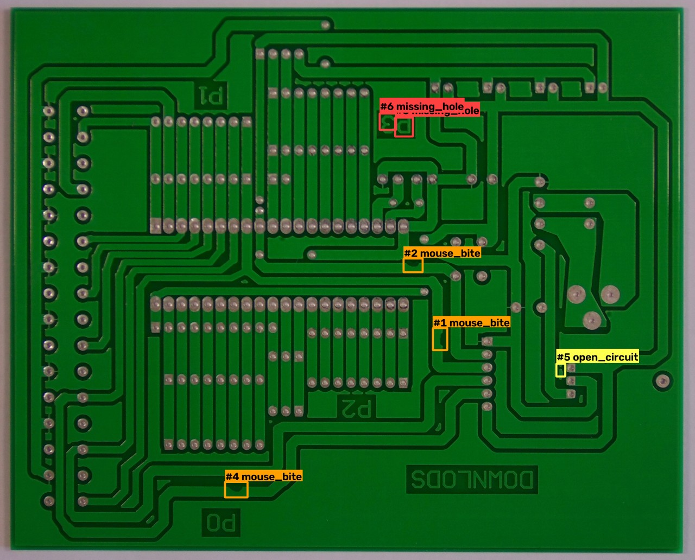
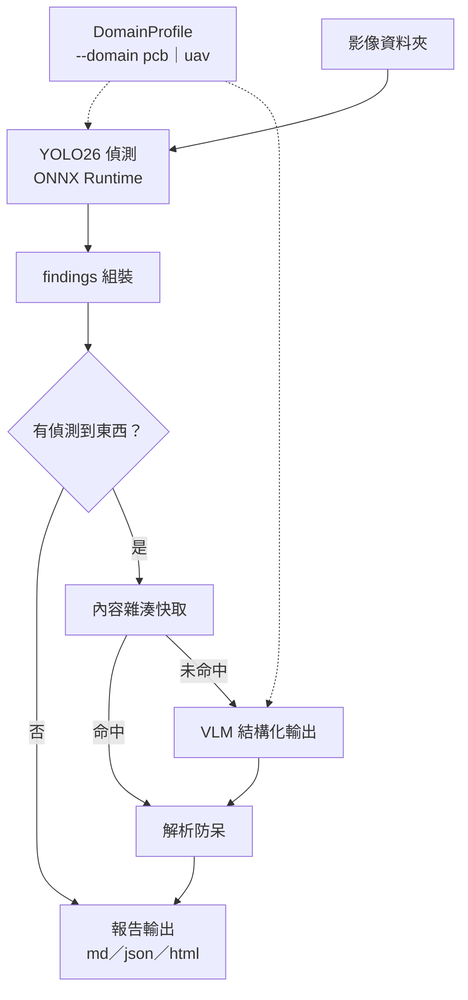

# visual-inspection-reporter

> PCB 產線巡檢報告產生器：本地 YOLO26 ONNX 偵測 + 商用 VLM API → 繁體中文巡檢報告

輸入一批 PCB 影像，輸出一份繁體中文巡檢報告（`report.md` + `report.json` + 可選 `report.html`）：自訓的 YOLO26n 小模型在本地做瑕疵偵測（ONNX Runtime、CPU 即可），偵測結果組裝成「編號標註整圖 + 局部放大圖 + 偵測 JSON」交給商用 VLM（預設 Gemini flash-lite 級）做嚴重度分級、繁中說明與建議處置，最後彙整成含總覽統計與成本附錄的報告。

**展示重點：API 工程與系統整合**——供應商抽象層（Gemini / OpenAI / Claude 三家實測可切換）、結構化輸出（JSON schema + 解析防呆）、內容雜湊快取、指數退避重試（含 Google 專屬的 JSON-body RetryInfo 解析）、RPM 限速、Gemini Batch API 5 折非同步模式、實測 token 成本統計，以及 `--domain` 抽象讓同一條 pipeline 換一組權重/類別/prompt 就能服務完全不同的任務（見下方「跨領域可移植性」）。




## 為什麼「偵測用自訓小模型、理解與文字生成用 API 大模型」？

| | 自訓 YOLO26n（本地 ONNX） | 商用 VLM API |
|---|---|---|
| 擅長 | 固定類別的定位與召回，毫秒級、零 API 成本 | 開放式視覺理解、誤檢識別、專業文字生成 |
| 不擅長 | 說明「為什麼有問題、該怎麼處理」 | 精確定位小目標；逐張全圖掃描又貴又慢 |
| 實測 | CPU p50 ≈ 81 ms/張（上游 benchmark） | flash-lite 級 ≈ $0.0027/張（本 repo 實測） |

兩段式分工讓 VLM 只看「已裁好、已標號」的少量像素，token 花在刀口上：偵測負責「哪裡有什麼」，VLM 負責「多嚴重、為什麼、怎麼辦」。VLM 還能反過來抓偵測模型的誤檢——實測中它把絲印文字誤判的 `missing_hole` 全數識破並標註「誤檢，建議人工確認」。

## 架構



細節都在下面的「工程細節」——圖只畫主流程，避免節點塞太多字被 GitHub 縮小到看不清楚。

工程細節：

- **供應商抽象**：`VLMProvider` 介面 + factory，`--provider gemini|openai|claude` 一鍵切換（三家皆以真實 API 驗證）。Gemini 走 `google-genai` 的 `response_schema`，OpenAI 走 Responses API 的 `responses.parse`，Claude 走 Messages API 的 `messages.parse(output_format=...)`。
- **結構化輸出 + 防呆**：Pydantic schema 直接下到 API；回傳的 `finding_id` 必須是偵測 JSON id 的子集——幻覺 id 剔除、漏評 id 在報告標「未評估」，不捏造內容。
- **快取**：鍵 = sha256(原圖 bytes + 偵測 JSON + 模型 + prompt 版本 + schema 版本)。同批重跑成本 $0；改 prompt 自動失效。
- **韌性**：429/5xx/逾時指數退避（最多 5 次），等待秒數取「供應商建議值」與「指數退避」的較大值——一般 SDK 走 HTTP `Retry-After` 標頭，但 google-genai 的 429 把建議秒數放在 JSON body 的 `google.rpc.RetryInfo` 裡（沒有標頭），兩種都有解析，這是實測踩過才補上的）＋滑動窗 RPM 限速（預設 8，對應 Gemini 免費層；`--max-rpm 0` 停用）；單圖失敗記入報告該圖、不炸整批。
- **Gemini Batch API**（`--batch-api`，僅 gemini）：先查快取，剩下的一次送成一個 batch job（input/output 皆 5 折），輪詢至完成再取回——換取 5 折的代價是非即時（官方 SLA 最長 24 小時，小批次實務上通常快得多）。用 `InlinedRequest`/`InlinedResponse` 的 `metadata` 欄位對應原始請求，不依賴回傳順序。
- **成本統計**：token 數取 API 回傳的實際 usage，依官方定價（同步或 Batch 5 折）換算 USD 附在報告末尾。

## 範例報告

節錄自 [assets/sample_report.md](assets/sample_report.md)（5 張樣本圖實際輸出）：

> ### 4. 04_short_01.jpg — 判定：不合格
>
> | # | 類別 | 信心 | 嚴重度 | 說明 | 建議處置 |
> |---|---|---|---|---|---|
> | #1 | 短路（short） | 0.66 | 重大 | 走線間出現明顯的銅橋接，造成短路，嚴重影響電氣功能。 | 判定為不合格，需進行報廢或返修評估。 |
> | #2 | 缺孔（missing_hole） | 0.53 | 輕微 | 經檢視局部放大圖，該區域為絲印文字而非鑽孔，模型誤判為缺孔。 | 此項為誤檢，無需處理。 |
>
> **總評**：本板存在多項嚴重瑕疵，包含短路與斷路，直接影響電路功能，判定為不合格。

## 成本實測（2026-07-09，匯率 32.1）

以本 repo 實測 usage 換算（token 數為 API 回傳值，單價為官方付費層定價；免費層實際帳單 $0）：

| 模型 | 實測基礎 | 每張約 | 每 100 張約 |
|---|---|---|---|
| `gemini-3.1-flash-lite`（預設） | 5 張批次：40,604 in / 2,305 out tokens，$0.0136 | $0.0027 | **$0.27 ≈ NT$8.7** |
| `gpt-5.4-nano`（--provider openai） | 1 張：3,871 in / 676 out，$0.0016 | $0.0016 | $0.16 ≈ NT$5.2 |
| `gemini-3.5-flash`（升級複核用） | 1 張：8,819 in / 2,898 out，$0.0393 | $0.0393 | $3.93 ≈ NT$126 |

模型選擇建議：日常巡檢用 flash-lite 級即可；實測發現 lite 級對**細微低對比瑕疵**（如殘銅細線）可能誤判為誤檢，同一張圖 `gemini-3.5-flash` 能正確識別三處殘銅並讀出絲印文字內容——重要批次可用 `--model gemini-3.5-flash` 複核（約 15 倍成本）。

## 跨領域可移植性：`--domain uav`

同一條 pipeline（偵測 → findings 組裝 → VLM 結構化輸出 → 報告）換一組 `DomainProfile`（權重 + 類別表 + prompt + 報告詞彙）就能服務完全不同的任務，不用改 detector/pipeline/report 程式碼一行。實測換成另一個作品集專案 [uav-traffic-vision](https://huggingface.co/betty0/uav-traffic-vision) 的 YOLO26s VisDrone 權重（10 類：行人/人群/腳踏車/小客車/廂型車/卡車/三輪車/篷布三輪車/公車/機車），輸出「無人機空拍巡邏報告」而非「PCB 巡檢報告」：

```bash
uv run python inspect_cli.py --input-dir my_drone_photos --output output_uav/ --domain uav
```

實測一張 182 個物件的密集路口空拍圖，`gemini-3.1-flash-lite` 一次 API 呼叫全數評估完畢，總評正確抓到「路口車流量大但秩序尚可、無立即安全風險」的情境判斷——PCB 領域的「嚴重度/判定」語意（瑕疵嚴重度、良品/不良品）在 prompt 換成巡邏語意（風險關注程度、是否需通報）後依然運作正常，這就是「domain profile 只換資料與措辭、工程骨架不動」的驗證。

換領域只需要在 `src/inspector/domains.py` 加一個 `DomainProfile`（權重路徑、類別表、prompt、報告詞彙、已知侷限），不用碰 `detector.py`/`pipeline.py`/`report.py`。VisDrone 資料集僅限學術用途，本 repo 不隨附任何無人機影像，需自備測試圖。UAV 權重同樣不隨 repo 發佈，需另外下載到 `weights/`：

```bash
hf download betty0/uav-traffic-vision yolo26s_visdrone_640.onnx --local-dir weights
```

## 更多輸出格式

```bash
uv run python inspect_cli.py --input-dir sample_images --output output/ --html
```

多產出一份 `report.html`，沿用 Gradio 介面的深色主題色票（見 DESIGN.md），方便直接寄送或用瀏覽器開啟而不需要 Markdown 檢視器。

## 快速開始

需求：[uv](https://docs.astral.sh/uv/)、repo 根目錄 `.env`（`GEMINI_API_KEY=...`，或 `GOOGLE_API_KEY=...` 亦可——`google-genai` 兩者都認，優先採用 `GOOGLE_API_KEY`；用 OpenAI/Claude 則另加 `OPENAI_API_KEY`/`ANTHROPIC_API_KEY`，只用預設 Gemini 的話兩者皆非必要）。

```bash
git clone <this-repo> && cd visual-inspection-reporter
uv sync

# 權重（不隨 repo 發佈）：從 Hugging Face 下載 best.onnx 放進 weights/
hf download betty0/pcb-defect-detection best.onnx --local-dir weights

# CLI：批次巡檢
uv run python inspect_cli.py --input-dir sample_images --output output/
uv run python inspect_cli.py --input-dir ... --provider openai          # 換供應商（gemini｜openai｜claude）
uv run python inspect_cli.py --input-dir ... --model gemini-3.5-flash   # 換模型
uv run python inspect_cli.py --input-dir ... --detect-only              # 只跑偵測
uv run python inspect_cli.py --input-dir ... --domain uav               # 換領域（見上方「跨領域可移植性」）
uv run python inspect_cli.py --input-dir ... --batch-api                # Gemini Batch API（5 折、非即時）
uv run python inspect_cli.py --input-dir ... --html                     # 額外產出 report.html

# Gradio 介面（http://localhost:7860；供應商可切換，但 --domain/--batch-api 目前僅 CLI 提供）
uv run python app.py

# 測試（mock VLM，零網路）
uv run pytest
```

主要參數：`--conf` 偵測閾值（預設依 `--domain`）、`--max-workers` 併發（4）、`--max-rpm` 限速（8，`0` 停用）、`--no-cache` 停用快取。

測試影像：HRIPCB 資料集不隨 repo 發佈，可從 [Kaggle akhatova/pcb-defects](https://www.kaggle.com/datasets/akhatova/pcb-defects) 下載後任選幾張放進 `sample_images/`。

## 專案結構

```
inspect_cli.py / app.py          # CLI 與 Gradio 進入點
src/inspector/
├── config.py                    # 跨領域共用定價表（含查證日期）、閾值、版本號
├── domains.py                   # DomainProfile：pcb｜uav 各自的權重/類別/prompt/報告詞彙
├── detector.py                  # ONNX Runtime 推論（YOLO26 e2e 免 NMS，class_names 由呼叫端傳入）
├── findings.py                  # 編號標註圖（依 class_id 取色，跟領域脫鉤）、context 裁切、偵測 JSON
├── schema.py / prompt.py        # Pydantic 輸出 schema、各領域的繁中巡檢指示
├── providers/                   # gemini.py、openai_provider.py、claude.py、base.py（抽象層）
├── batch_gemini.py              # Gemini Batch API：送出/輪詢/取回（metadata 對應原始請求）
├── cache.py / cost.py / retry.py# 快取、成本統計（同步/Batch 兩種定價）、退避重試＋RPM 限速
├── pipeline.py                  # 批次流程（併發或 Batch API 二選一、單圖錯誤隔離）
└── report.py                    # report.md / report.json / report.html 渲染
tests/                           # 28 項 pytest（MockProvider，零網路）
```

## 侷限

- 偵測模型在最誠實的 board-grouped split 下 `short` 類 AP50 僅 0.565、`spurious_copper` 0.793（見[上游專案](https://huggingface.co/betty0/pcb-defect-detection)），漏檢的瑕疵 VLM 看不到；UAV 領域則是 `awning-tricycle`（AP50-95 0.107）與 `bicycle`（0.124）最弱，且極小物件整體偏低（見 [uav-traffic-vision](https://huggingface.co/betty0/uav-traffic-vision)）。
- flash-lite 級 VLM 對細微低對比瑕疵有極限（見成本一節的殘銅案例）。
- Gemini 免費層限速嚴格（本帳戶實測 flash-lite 級約 10 RPM、Batch API 也共用同一份免費額度），大批量或想穩定跑 Batch API 請調 `--max-rpm` 或升級付費層——本 repo 開發期間就因為在同一個免費帳戶上密集測試多個功能，實際撞過 429 配額耗盡（含 Batch API 提交本身），這也是韌性層要處理 Google 專屬 RetryInfo 的原因。
- Claude provider 的程式碼路徑已用真實 API 打通驗證過請求格式正確（拿到結構化的 API 層級錯誤，不是用戶端格式錯誤），但受限於當時測試帳戶額度不足，未能取得成功回應的完整範例；程式碼與其餘兩家供應商共用同一套抽象層與測試模式。
- Gemini Batch API 程式碼已對照真實安裝的 SDK 型別驗證過（`InlinedRequest`/`InlinedResponse`/`JobState` 等），並實測 4 支不同帳號/專案的 API key：3 支撞到同一份免費額度的 429、1 支回 400 `FAILED_PRECONDITION`——這個錯誤在 Gemini API 幾乎都對應同一件事：**該 GCP 專案沒有連結計費帳戶**，送出 batch job 這個動作本身要求專案綁過付款方式，即使實際用量仍落在免費層、不會被扣款。目前手上的 key 沒有一個滿足這個前提，需要使用者自行到 Google Cloud Console 為專案綁定計費方式才能實測成功案例。

## 資料集與授權

- 偵測權重與推論程式碼衍生自上游專案 [pcb-defect-detection](https://huggingface.co/betty0/pcb-defect-detection)（以 ultralytics YOLO26 訓練）。
- 資料集：HRIPCB（PKU-Market-PCB），來源 [Kaggle akhatova/pcb-defects](https://www.kaggle.com/datasets/akhatova/pcb-defects)，授權未明，引用 [Huang & Wei (2019)](https://arxiv.org/abs/1901.08204)；影像不隨 repo 發佈。
- License：**AGPL-3.0-or-later**（受 ultralytics 授權傳染條款約束）。
